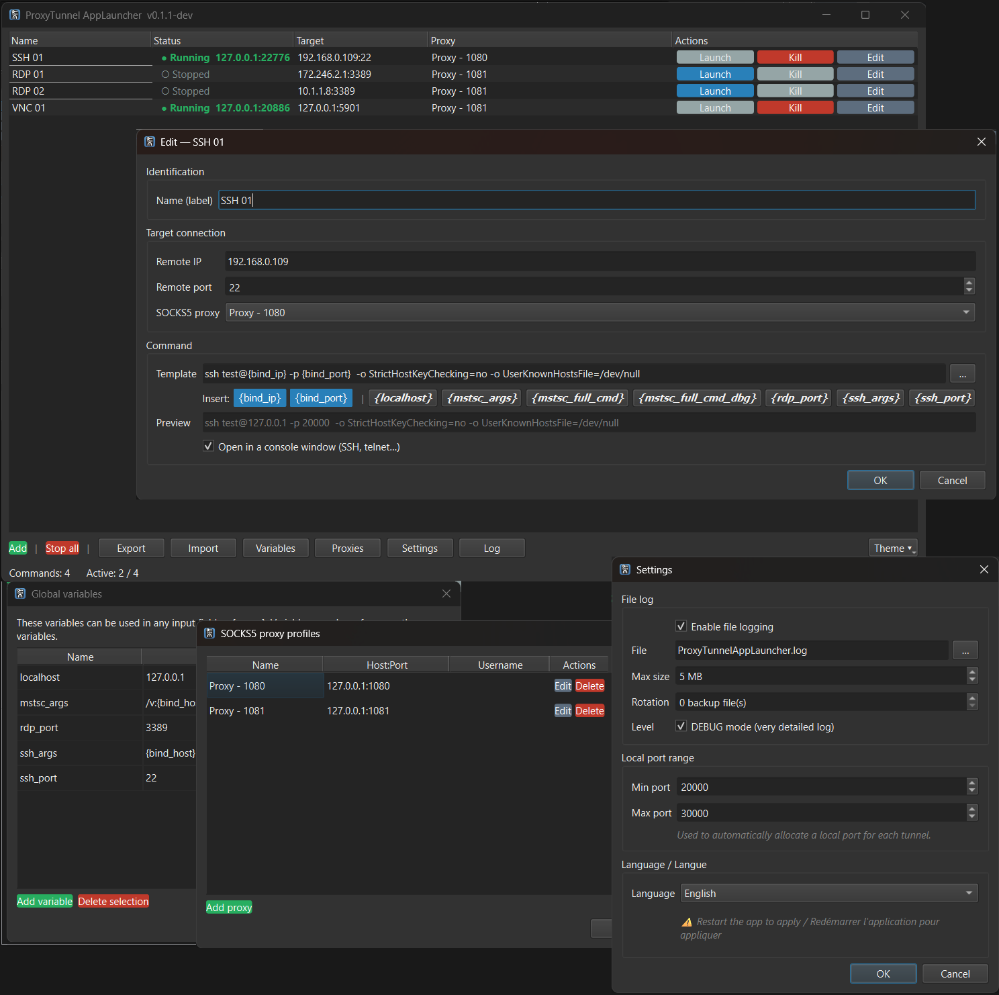

<p align="center">
  
</p>

# ProxyTunnelAppLauncher

🇬🇧 [English](#english) · 🇫🇷 [Français](#français)

License: GPL v3+  
Python 3.10+ · PyQt6 · PySocks

---

<a name="english"></a>
## English

### What it does

ProxyTunnelAppLauncher launches any application through a SOCKS5 tunnel — for software that has no built-in proxy option (RDP, SSH, VNC, custom tools, etc.).

Each command is configured with:
- a **target** (remote IP + port)
- a **SOCKS5 proxy** (named reusable profile)
- a **command template** using `{bind_ip}` and `{bind_port}` placeholders

When a command is launched, the app:
1. Allocates a random **local port** within the configured range
2. Creates a **TCP tunnel**: `127.0.0.1:<auto_port>` → `remote_target` via the SOCKS5 proxy
3. Resolves placeholders and **runs the command**
4. **Tears down the tunnel** automatically when the process exits

**RDP example:**
```
Target   : 192.168.0.201 : 3389
Proxy    : My-SSH-Bastion (127.0.0.1:2222)
Command  : mstsc /v:{bind_ip}:{bind_port}

→ Tunnel created : 127.0.0.1:24731 → 192.168.0.201:3389 via 127.0.0.1:2222
→ Command run    : mstsc /v:127.0.0.1:24731
```

**SSH example (interactive console):**
```
Target   : 10.0.0.5 : 22
Proxy    : My-SSH-Bastion (127.0.0.1:2222)
Command  : ssh user@{bind_ip} -p {bind_port}  [✓ Interactive console]

→ Tunnel created : 127.0.0.1:27854 → 10.0.0.5:22 via 127.0.0.1:2222
→ SSH opens in its own console window
```

---

### Screenshot

<!-- Add a screenshot here once available:  -->

---

### Installation

```bash
# 1. Create the virtual environment and install dependencies (once)
python -m venv venv
# Windows :    venv\Scripts\pip install -r requirements.txt
# Linux/macOS : venv/bin/pip install -r requirements.txt

# 2a. Run with venv activation
# Windows :    venv\Scripts\activate
# Linux/macOS : source venv/bin/activate
python ProxyTunnelAppLauncher.py

# 2b. Run without activating (direct call)
# Windows :    venv\Scripts\python ProxyTunnelAppLauncher.py
# Linux/macOS : venv/bin/python ProxyTunnelAppLauncher.py
```

**Dependencies:**
- Python 3.10+
- PyQt6 >= 6.6.0
- PySocks >= 1.7.1

#### Don't trust pre-built binaries?

Windows, Linux, and macOS binaries are compiled automatically by GitHub Actions from this public repository — the workflow is visible in [`.github/workflows/build-release.yml`](.github/workflows/build-release.yml).

If you prefer not to run a pre-compiled binary, launch the app directly from the Python sources using the commands above. The code is licensed GPL v3+ — you can audit, modify, and redistribute it freely.

---

### Usage

```bash
# Via direct launcher
python ProxyTunnelAppLauncher.py

# Via Python module
python -m ProxyTunnelAppLauncher
```

---

### Interface overview

#### Main window

The central table lists all configured commands:

| Column | Description |
|--------|-------------|
| **Name** | Command label |
| **Status** | Running / Stopped, local port shown when active |
| **Target** | Remote `host:port` |
| **Proxy** | Associated proxy profile (red if not found) |
| **Actions** | Launch / Kill / Edit buttons |

**Double-click** a stopped command to launch it directly.  
**Right-click** for: Launch, Kill, Edit, Duplicate, Delete.

#### Button bar

| Button | Function |
|--------|----------|
| **Add** | Create a new command |
| **Stop all** | Stop all active tunnels |
| **Export** | Save configuration to a JSON file |
| **Import** | Load configuration with conflict handling |
| **Variables** | Manage reusable global variables |
| **Proxies** | Manage SOCKS5 proxy profiles |
| **Settings** | Configure port range and log file |
| **Log** | Open the log window |

A **theme selector** (System / Light / Dark) is available at the bottom right.

---

### Command configuration

| Field | Description |
|-------|-------------|
| **Name** | Unique label shown in the table |
| **Remote IP** | Target remote host |
| **Remote port** | Target remote port |
| **SOCKS5 proxy** | Proxy profile to use (optional) |
| **Command** | Template with placeholders (see below) |
| **Interactive console** | Opens the command in its own console window — useful for SSH, telnet |

#### Available placeholders

| Placeholder | Value |
|-------------|-------|
| `{bind_ip}` | Local tunnel IP (`127.0.0.1`) |
| `{bind_port}` | Automatically allocated local port |
| `{variable_name}` | Any global variable defined in **Variables** |

The editor provides **quick-insert buttons** and a **real-time resolved preview**.

---

### SOCKS5 proxy profiles

Each profile contains:
- **Name** — reusable identifier across commands
- **Host / Port** — SOCKS5 server address
- **User / Password** — optional authentication
- **"Test" button** — verifies TCP connectivity to the proxy in real time

Profiles are shared across all commands. **Renaming** a profile automatically propagates to all commands using it.

---

### Global variables

Variables let you factor out common values used in command templates.

Default variables:

| Variable | Value |
|----------|-------|
| `{localhost}` | `127.0.0.1` |
| `{ssh_port}` | `22` |
| `{rdp_port}` | `3389` |

Variables can be nested (resolved up to 5 passes).

---

### Import / Export

Export saves all proxies and commands to a JSON file.

Import automatically detects conflicts:
- **New** → will be added
- **Identical** → skipped (already up to date)
- **Conflict** → per-row choice: Overwrite or Ignore

---

### Settings

#### Local port range
Range within which local ports are **randomly** allocated to each tunnel.  
Default: `20000 – 30000`.

#### Log file
Enables writing logs to a rotating file (`ProxyTunnelAppLauncher.log` by default).  
Configurable: max size (MB) and rotation count.  
Default log level: **INFO** (DEBUG messages are not written to the file).

---

### Configuration files

Files are created automatically in the **working directory** on first run.

> ⚠️ These files may contain addresses and passwords. They are excluded from the git repository by `.gitignore`.

#### `configs.json`
Stores proxy profiles and commands.

```json
{
  "port_range": [20000, 30000],
  "proxies": [
    {
      "name": "My-Bastion",
      "host": "127.0.0.1",
      "port": 2222,
      "user": null,
      "password": null
    }
  ],
  "commands": [
    {
      "name": "RDP Server",
      "target_host": "192.168.0.201",
      "target_port": 3389,
      "proxy": "My-Bastion",
      "command": "mstsc /v:{bind_ip}:{bind_port}",
      "order": 0,
      "console": false
    }
  ]
}
```

#### `settings.json`
Stores preferences and global variables.

```json
{
  "theme": "Système",
  "log_file_enabled": false,
  "log_file_path": "ProxyTunnelAppLauncher.log",
  "log_file_max_mb": 5,
  "log_file_backup_count": 3,
  "variables": {
    "localhost": "127.0.0.1",
    "ssh_port": "22",
    "rdp_port": "3389"
  }
}
```

---

### macOS — First launch

The app is not signed with a paid Apple certificate. macOS blocks it on first run.

**Method 1 — System Settings (no Terminal)**

1. Try to open `ProxyTunnelAppLauncher` (launch is blocked)
2. Open **System Settings → Privacy & Security**
3. Scroll down → a message *"ProxyTunnelAppLauncher was blocked"* appears
4. Click **"Allow Anyway"**
5. Reopen the app → confirm with **"Open Anyway"**

**Method 2 — Terminal**

```bash
xattr -dr com.apple.quarantine /path/to/ProxyTunnelAppLauncher
```
Then double-click normally.

---

### Building with Nuitka

**Windows:**

```batch
pip install --upgrade wheel setuptools nuitka

.\venv_win\Scripts\python.exe -m nuitka --onefile --remove-output --standalone ^
  --enable-plugin=pyqt6 --windows-console-mode=disable ^
  --windows-icon-from-ico=logo.ico ^
  --include-data-files=logo.ico=logo.ico ^
  --include-data-dir=translations=translations ^
  ProxyTunnelAppLauncher.py
```

**Linux:**

```bash
python -m nuitka --onefile --remove-output --standalone \
  --enable-plugin=pyqt6 \
  --include-data-files=logo.png=logo.png \
  --include-data-dir=translations=translations \
  ProxyTunnelAppLauncher.py
```

**macOS:**

```bash
python -m nuitka --onefile --remove-output --standalone \
  --enable-plugin=pyqt6 \
  --macos-create-app-bundle \
  --macos-app-icon=logo.png \
  --include-data-files=logo.png=logo.png \
  --include-data-dir=translations=translations \
  ProxyTunnelAppLauncher.py
```

Produces a standalone `ProxyTunnelAppLauncher` (or `.exe`) binary.  
`configs.json` and `settings.json` are read from the **current directory** at runtime, not bundled.

---

### Project structure

```
ProxyTunnelAppLauncher/
    __main__.py              # Entry point (python -m ProxyTunnelAppLauncher)
    models.py                # ProxyProfile, CommandEntry, AppConfig, AppSettings
    forwarder.py             # SimpleForwarder — TCP tunnel via SOCKS5
    tunnel_manager.py        # TunnelManager — tunnel and process lifecycle
    config_io.py             # Read / write configs.json
    settings_io.py           # Read / write settings.json
    ui/
        main_window.py       # Main window
        command_tree.py      # Command table widget
        tree_delegate.py     # Table visual renderer
        log_window.py        # Log window
        dialogs/
            command_dialog.py    # Create / edit a command
            proxy_dialog.py      # Manage proxy profiles
            variables_dialog.py  # Manage global variables
            settings_dialog.py   # Settings (ports, logs, theme)
            import_dialog.py     # Import with conflict handling
ProxyTunnelAppLauncher.py    # Direct launcher
requirements.txt
```

---

### License compliance

This project is licensed under the **GNU GPL v3 or later**.

| Library | License | GPL v3 compatible |
|---------|---------|:-----------------:|
| PySocks >= 1.7.1 | BSD 3-Clause | ✓ |
| PyQt6 >= 6.6.0 | GPL v3 (Riverbank Computing) | ✓ |
| Python standard library | PSF License | ✓ |

---

### Contributing

Contributions are welcome!

1. Fork the repository
2. Create a branch: `git checkout -b feature/my-feature`
3. Commit your changes
4. Open a Pull Request

Please report bugs and suggestions via [GitHub Issues](../../issues).  
All contributions must be compatible with the GPL v3+ license.

---

### Project history

Following a career reorientation — from hosted platform administration to application development for system administration, operations, and automation — I wanted to fill a gap in practical tooling: existing alternatives were either absent or paid without being truly ergonomic.

This project also has a formative purpose: practicing the development of complex applications with a graphical interface. Python was the natural choice, as it's the language I use daily.

From the start, I wanted a cross-platform tool, targeting primarily Windows and Linux (macOS should work too).

The program started with SOCKS5 forwarding management and a Tkinter interface. The original code was functional but minimal — and Tkinter doesn't make ergonomics easy. I then improved the interface progressively, first with a local AI and manual tweaks. It was sufficient for my own use, without being truly polished.

I recently subscribed to an Anthropic Pro account to deepen my work on the code architecture, and chose this project as the testing ground. The entire interface was rewritten in **PyQt6** with the help of [Claude](https://claude.ai), replacing Tkinter with something far more modern and ergonomic. The application is today much more accessible and better structured — which led me to make it public.

---

<a name="français"></a>
## Français

### Principe

ProxyTunnelAppLauncher lance n'importe quelle application via un tunnel SOCKS5, pour les logiciels qui ne disposent pas d'option proxy native (RDP, SSH, VNC, etc.).

Chaque commande est configurée avec :
- une **cible** (IP distante + port)
- un **proxy SOCKS5** (profil nommé réutilisable)
- une **commande** à exécuter, avec les placeholders `{bind_ip}` et `{bind_port}`

Au lancement d'une commande, l'application :
1. Alloue automatiquement un **port local aléatoire** dans la plage configurée
2. Crée un **tunnel TCP** : `127.0.0.1:<port_auto>` → `cible_distante` via le proxy SOCKS5
3. Résout les placeholders et **exécute la commande**
4. **Détruit le tunnel** automatiquement quand le processus se termine

**Exemple RDP :**
```
Cible    : 192.168.0.201 : 3389
Proxy    : Mon-Bastion-SSH (127.0.0.1:2222)
Commande : mstsc /v:{bind_ip}:{bind_port}

→ Tunnel créé  : 127.0.0.1:24731 → 192.168.0.201:3389 via 127.0.0.1:2222
→ Commande lancée : mstsc /v:127.0.0.1:24731
```

**Exemple SSH (mode console) :**
```
Cible    : 10.0.0.5 : 22
Proxy    : Mon-Bastion-SSH (127.0.0.1:2222)
Commande : ssh user@{bind_ip} -p {bind_port}  [✓ Console interactive]

→ Tunnel créé  : 127.0.0.1:27854 → 10.0.0.5:22 via 127.0.0.1:2222
→ SSH s'ouvre dans sa propre fenêtre console
```

---

### Capture d'écran

<!-- Ajoutez une capture d'écran ici :  -->

---

### Installation

```bash
# 1. Créer le venv et installer les dépendances (une seule fois)
python -m venv venv
# Windows :    venv\Scripts\pip install -r requirements.txt
# Linux/macOS : venv/bin/pip install -r requirements.txt

# 2a. Lancer avec activation du venv
# Windows :    venv\Scripts\activate
# Linux/macOS : source venv/bin/activate
python ProxyTunnelAppLauncher.py

# 2b. Lancer sans activation (appel direct)
# Windows :    venv\Scripts\python ProxyTunnelAppLauncher.py
# Linux/macOS : venv/bin/python ProxyTunnelAppLauncher.py
```

**Dépendances :**
- Python 3.10+
- PyQt6 >= 6.6.0
- PySocks >= 1.7.1

#### Confiance limitée dans le build ?

Les binaires Windows, Linux et macOS sont compilés automatiquement par GitHub Actions à partir de ce dépôt public — le workflow est visible dans [`.github/workflows/build-release.yml`](.github/workflows/build-release.yml).

Si vous préférez ne pas exécuter un binaire pré-compilé, vous pouvez lancer l'application directement depuis les sources Python avec les commandes ci-dessus. Le code est sous licence GPL v3+ — vous pouvez l'auditer, le modifier et le redistribuer librement.

---

### Lancement

```bash
# Via le lanceur direct
python ProxyTunnelAppLauncher.py

# Via le module Python
python -m ProxyTunnelAppLauncher
```

---

### Interface

#### Fenêtre principale

Le tableau central liste toutes les commandes configurées avec les colonnes :

| Colonne | Description |
|---------|-------------|
| **Nom** | Label de la commande |
| **Statut** | En cours / Arrêté, port local alloué affiché si actif |
| **Cible** | `host:port` distant |
| **Proxy** | Profil proxy associé (en rouge si introuvable) |
| **Actions** | Boutons Lancer / Tuer / Modifier |

**Double-clic** sur une commande arrêtée pour la lancer directement.  
**Clic droit** pour accéder à : Lancer, Tuer, Modifier, Dupliquer, Supprimer.

#### Barre de boutons

| Bouton | Fonction |
|--------|----------|
| **Ajouter** | Créer une nouvelle commande |
| **Tout arrêter** | Arrêter tous les tunnels actifs |
| **Exporter** | Sauvegarder la configuration dans un fichier JSON |
| **Importer** | Charger une configuration avec gestion des conflits |
| **Variables** | Gérer les variables globales réutilisables |
| **Proxies** | Gérer les profils proxy SOCKS5 |
| **Paramètres** | Configurer la plage de ports et le journal |
| **Journal** | Ouvrir la fenêtre de logs |

Un sélecteur de **thème** (Système / Clair / Sombre) est disponible en bas à droite.

---

### Configuration d'une commande

| Champ | Description |
|-------|-------------|
| **Nom** | Label unique affiché dans le tableau |
| **IP distante** | Hôte cible distant |
| **Port distant** | Port cible distant |
| **Proxy SOCKS5** | Profil proxy à utiliser (optionnel) |
| **Commande** | Template avec placeholders (voir ci-dessous) |
| **Console interactive** | Ouvre la commande dans sa propre fenêtre console — utile pour SSH, telnet |

#### Placeholders disponibles dans la commande

| Placeholder | Valeur |
|-------------|--------|
| `{bind_ip}` | IP locale du tunnel (`127.0.0.1`) |
| `{bind_port}` | Port local alloué automatiquement |
| `{nom_variable}` | Toute variable globale définie dans **Variables** |

L'éditeur propose des **boutons d'insertion rapide** et un **aperçu résolu** en temps réel.

---

### Profils proxy SOCKS5

Chaque profil contient :
- **Nom** — identifiant réutilisable dans les commandes
- **Host / Port** — adresse du serveur SOCKS5
- **Utilisateur / Mot de passe** — authentification optionnelle
- **Bouton "Tester"** — vérifie la connectivité TCP vers le proxy en temps réel

Les profils sont partagés entre toutes les commandes. Un **renommage** de profil se répercute automatiquement sur toutes les commandes qui l'utilisent.

---

### Variables globales

Les variables permettent de factoriser des valeurs communes utilisées dans les templates de commandes.

Variables par défaut :

| Variable | Valeur |
|----------|--------|
| `{localhost}` | `127.0.0.1` |
| `{ssh_port}` | `22` |
| `{rdp_port}` | `3389` |

Les variables peuvent être imbriquées (résolution jusqu'à 5 passes).

---

### Import / Export

L'export sauvegarde l'intégralité des proxies et commandes dans un fichier JSON.

L'import détecte automatiquement les conflits :
- **Nouveau** → sera ajouté
- **Identique** → ignoré (déjà à jour)
- **Conflit** → choix par ligne : Écraser ou Ignorer

---

### Paramètres

#### Plage de ports locaux
Plage dans laquelle les ports locaux sont alloués **aléatoirement** à chaque tunnel.
Par défaut : `20000 – 30000`.

#### Journal fichier
Active l'écriture des logs dans un fichier rotatif (`ProxyTunnelAppLauncher.log` par défaut).
Configurable : taille max (Mo) et nombre de fichiers de rotation.  
Niveau par défaut : **INFO** (les messages DEBUG ne sont pas écrits dans le fichier).

---

### Fichiers de configuration

Les fichiers sont créés automatiquement dans le **répertoire de travail** au premier lancement.

> ⚠️ Ces fichiers peuvent contenir des adresses et mots de passe. Ils sont exclus du dépôt git par `.gitignore`.

#### `configs.json`
Stocke les profils proxy et les commandes.

```json
{
  "port_range": [20000, 30000],
  "proxies": [
    {
      "name": "Mon-Bastion",
      "host": "127.0.0.1",
      "port": 2222,
      "user": null,
      "password": null
    }
  ],
  "commands": [
    {
      "name": "Serveur RDP",
      "target_host": "192.168.0.201",
      "target_port": 3389,
      "proxy": "Mon-Bastion",
      "command": "mstsc /v:{bind_ip}:{bind_port}",
      "order": 0,
      "console": false
    }
  ]
}
```

#### `settings.json`
Stocke les préférences et variables globales.

```json
{
  "theme": "Système",
  "log_file_enabled": false,
  "log_file_path": "ProxyTunnelAppLauncher.log",
  "log_file_max_mb": 5,
  "log_file_backup_count": 3,
  "variables": {
    "localhost": "127.0.0.1",
    "ssh_port": "22",
    "rdp_port": "3389"
  }
}
```

---

### macOS — Premier lancement

L'application n'est pas signée avec un certificat Apple payant. macOS bloque son exécution au premier lancement.

**Méthode 1 — Réglages Système (sans Terminal)**

1. Tenter d'ouvrir `ProxyTunnelAppLauncher` (le lancement est bloqué)
2. Ouvrir **Réglages Système → Confidentialité et sécurité**
3. Faire défiler vers le bas → un message *"ProxyTunnelAppLauncher a été bloqué"* apparaît
4. Cliquer **"Autoriser quand même"**
5. Rouvrir l'application → confirmer avec **"Ouvrir quand même"**

**Méthode 2 — Terminal**

```bash
xattr -dr com.apple.quarantine /chemin/vers/ProxyTunnelAppLauncher
```
Puis double-cliquer normalement.

---

### Compilation en exécutable (Nuitka)

**Windows :**

```batch
pip install --upgrade wheel setuptools nuitka

.\venv_win\Scripts\python.exe -m nuitka --onefile --remove-output --standalone ^
  --enable-plugin=pyqt6 --windows-console-mode=disable ^
  --windows-icon-from-ico=logo.ico ^
  --include-data-files=logo.ico=logo.ico ^
  --include-data-dir=translations=translations ^
  ProxyTunnelAppLauncher.py
```

**Linux :**

```bash
python -m nuitka --onefile --remove-output --standalone \
  --enable-plugin=pyqt6 \
  --include-data-files=logo.png=logo.png \
  --include-data-dir=translations=translations \
  ProxyTunnelAppLauncher.py
```

**macOS :**

```bash
python -m nuitka --onefile --remove-output --standalone \
  --enable-plugin=pyqt6 \
  --macos-create-app-bundle \
  --macos-app-icon=logo.png \
  --include-data-files=logo.png=logo.png \
  --include-data-dir=translations=translations \
  ProxyTunnelAppLauncher.py
```

Produit un binaire autonome `ProxyTunnelAppLauncher` (ou `.exe`).  
`configs.json` et `settings.json` sont lus dans le **répertoire courant** à l'exécution, non inclus dans le binaire.

---

### Structure du projet

```
ProxyTunnelAppLauncher/
    __main__.py              # Point d'entrée (python -m ProxyTunnelAppLauncher)
    models.py                # ProxyProfile, CommandEntry, AppConfig, AppSettings
    forwarder.py             # SimpleForwarder — tunnel TCP via SOCKS5
    tunnel_manager.py        # TunnelManager — cycle de vie des tunnels et processus
    config_io.py             # Lecture / écriture de configs.json
    settings_io.py           # Lecture / écriture de settings.json
    ui/
        main_window.py       # Fenêtre principale
        command_tree.py      # Widget tableau des commandes
        tree_delegate.py     # Rendu visuel du tableau
        log_window.py        # Fenêtre journal
        dialogs/
            command_dialog.py    # Créer / modifier une commande
            proxy_dialog.py      # Gérer les profils proxy
            variables_dialog.py  # Gérer les variables globales
            settings_dialog.py   # Paramètres (ports, logs, thème)
            import_dialog.py     # Import avec gestion des conflits
ProxyTunnelAppLauncher.py    # Lanceur direct
requirements.txt
```

---

### Conformité licence GPL v3

Ce projet est distribué sous licence **GNU GPL v3 ou ultérieure**.

| Bibliothèque | Licence | Compatible GPL v3 |
|--------------|---------|:-----------------:|
| PySocks >= 1.7.1 | BSD 3-Clause | ✓ |
| PyQt6 >= 6.6.0 | GPL v3 (Riverbank Computing) | ✓ |
| Bibliothèque standard Python | Licence PSF | ✓ |

---

### Contribuer

Les contributions sont les bienvenues !

1. Forkez le dépôt
2. Créez une branche : `git checkout -b feature/ma-fonctionnalite`
3. Commitez vos modifications
4. Ouvrez une Pull Request

Signalez bugs et suggestions via les [GitHub Issues](../../issues).  
Toute contribution doit être compatible avec la licence GPL v3+.

---

### Histoire du projet

Suite à une réorientation professionnelle — de l'administration de plateformes hébergées vers le développement d'applications pour l'administration système, l'exploitation et l'automatisation — j'ai voulu combler un manque d'outils pratiques : les alternatives existantes étant soit absentes, soit payantes sans être vraiment ergonomiques.

Ce projet a aussi une vocation formative : m'exercer au développement d'applications complexes avec interface graphique. Python s'est imposé naturellement, c'est le langage que j'utilise au quotidien.

Dès le départ, j'ai voulu un outil multiplateforme, ciblant en priorité Windows et Linux (macOS devrait fonctionner aussi).

Le programme a démarré avec la gestion de socks5 forwarding et une interface Tkinter. Le code d'origine était fonctionnel mais sommaire — et Tkinter ne facilite pas les choses côté ergonomie. J'ai ensuite amélioré l'interface progressivement, d'abord avec une IA en local et des retouches manuelles. C'était suffisant pour mon usage, sans être vraiment abouti.

J'ai récemment souscrit un abonnement Pro chez Anthropic pour approfondir mon travail sur l'architecture du code, et j'ai choisi cet autre projet comme terrain d'application. L'interface a été entièrement réécrite en **PyQt6** avec l'aide de [Claude](https://claude.ai), remplaçant Tkinter par quelque chose de bien plus moderne et ergonomique. L'application est aujourd'hui bien plus accessible et mieux structurée — ce qui m'a décidé à la rendre publique.
